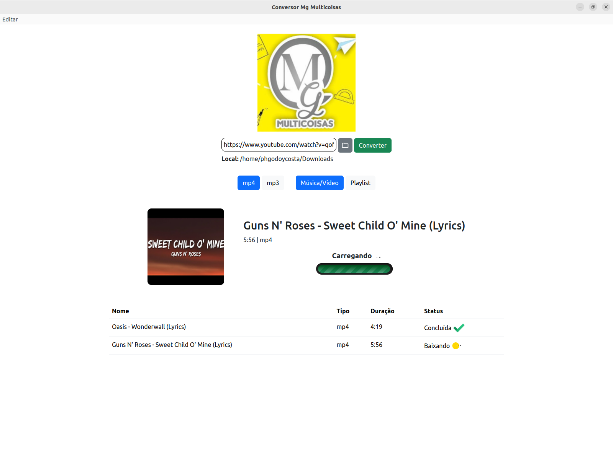

<div align=center>
    
</div>

# Conversor MG Multicoisas de Vídeos do Youtube

>  Um App Electron que faz o download de vídeos, audios ou playlists do youtube.


## 📎 Requerimentos

Para funcionar é necessário o download do FFMPEG na sua máquina:

[**FFMPEG**](https://ffmpeg.org/download.html)

Para rodar o programa no **Linux** é necessário o [**Python3**](https://www.python.org/downloads/) instalado + o download dos modulos em requirements.txt

```bash
$ pip3 install -r requirements.txt
```

## 🛠️ Funcionamento

Na prática são dois programas, o programa Electron que faz o papel de **client**, um servidor backend feito com Flask que funciona na **porta 53333**

Para saber mais informações sobre o desenvolvimento do projeto, porque ele se chama de **MG Multicoisas** e outros detalhes, segue o link para uma matéria completa publicada no meu site repositório:

**Link da Matéria Completa:** [https://phgodoycosta.com.br/projeto/youtube-conversor](https://phgodoycosta.com.br/projeto/youtube-conversor)

### Tela Inicial

<div align=center>
    
</div>

## 🔗 Download

Para fazer o download do programa, ele se encontra disponível pelos [**Releases do GitHub**](https://github.com/PHGodoyCosta/Youtube_Downloader/releases/latest)

A outra opção é clonar o código e fazer o build manualmente.

## 📦 Instalação

```bash
# Clonar o repositório
git clone https://github.com/PHGodoyCosta/Youtube_Downloader
cd Youtube_Downloader

# Instalar dependências Node
npm install
# ou usando pnpm
pnpm install

# Instalar dependências Python
pip3 install -r requirements.txt
```

Inicie primeiro o servidor Python Flask

```bash
python3 server/server.py
```

Depois inicie o Electron em modo develop

```bash
npm run start
```

### Build Local

Para realizar o build local, siga essas etapas:

#### Windows

```bash
npm run build:server:win
npm run build
```

#### Linux

```bash
$ npm run build
```

